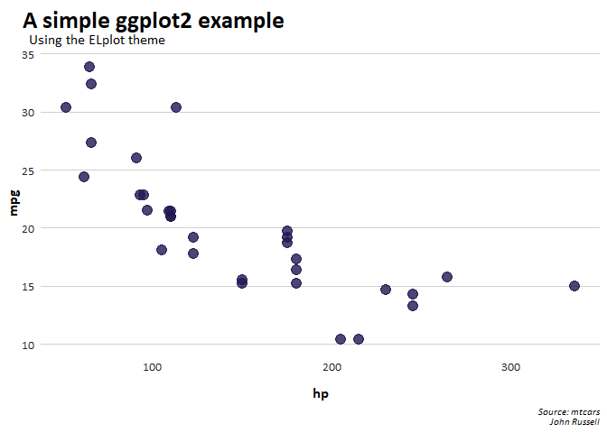

<!-- README.md is generated from README.Rmd. Please edit that file -->

# ELplot

<!-- badges: start -->
<!-- badges: end -->

The goal of ELplot is to standardize the work done in the Research team,
especially as relates to data visualizations. In order to do this, it is
useful to create functions that unify our theme, colors and other visual
elements.

## Loading libraries

In order to use the Calibri font, R will have to find it on your
desktop. This can be done pretty easily using the extrafonts package.

``` r
library(extrafont)
font_import()
```

Once you have run this once, you can always bring in these new fonts
using the following command:

``` r
loadfonts()
```

## Installation

You can install the development version of ELplot like so:

``` r
devtools::install_github('ELJRussell/ELplot')
```

## Using ELplot to create a theme

This is a basic example which shows you how to solve a common problem:

``` r
library(ELplot)
library(ggplot2)
extrafont::loadfonts()

ggplot(mtcars, aes(hp, mpg)) +
    geom_point(color = el_cols("dark navy"),
               size = 4, alpha = .8) +
    el_theme() +
    labs(title = "A simple ggplot2 example",
         subtitle = "Using the ELplot theme",
         caption = "Source: mtcars
         John Russell")
```


